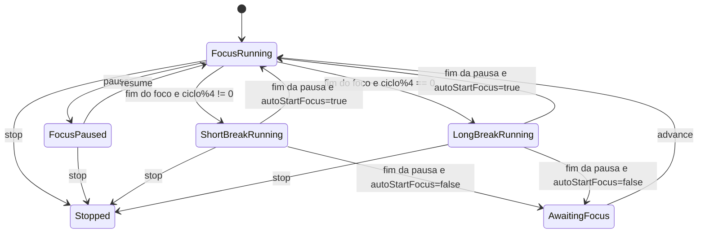
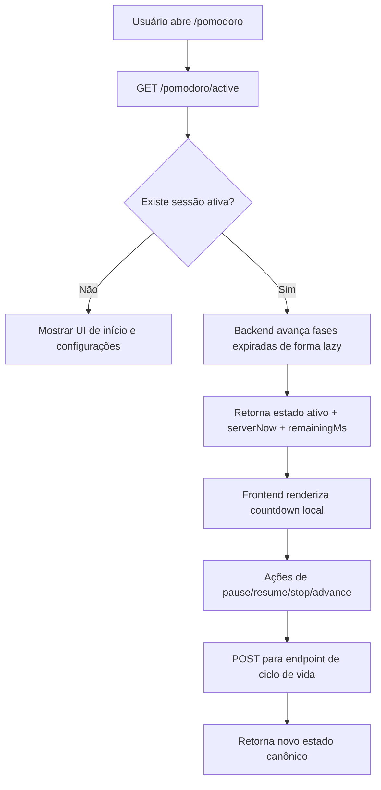

# Plano da Feature Pomodoro

## 1. Objetivo

Adicionar uma feature completa de Pomodoro ao `anotEX.ai` como parte nativa do fluxo de estudo, e não como um cronômetro isolado.

A funcionalidade deve ajudar o usuário a:

- iniciar blocos de estudo focado
- alternar foco e pausa com um ciclo Pomodoro canônico
- recuperar o timer após refresh, fechamento da aba ou troca de dispositivo
- conectar sessões de foco com atividades já existentes, como revisão, leitura de transcrição, chat e pastas de estudo
- acompanhar histórico de foco, streaks e métricas de produtividade

Este documento é apenas de planejamento. Não propõe código de implementação.

---

## 2. Contexto Atual do Projeto

## Encaixe no produto

O `anotEX.ai` já cobre o ciclo principal de aprendizagem:

- entrada de conteúdo: gravação, upload e YouTube
- processamento: transcrição, resumo, flashcards, quiz e mapa mental
- estudo: revisão, quiz, chat, pastas e grupos

O Pomodoro entra como a camada de execução desse ciclo: ele ajuda o usuário a realmente passar tempo focado estudando os materiais gerados.

## Arquitetura relevante hoje

### Backend

- NestJS 11
- Clean Architecture por módulo
- Supabase Postgres com RLS
- Supabase Auth validado por guard global
- BullMQ + Redis para processamento assíncrono de IA
- Módulos atuais já persistem atividade de estudo por usuário:
  - `chat_messages`
  - `flashcard_reviews`
  - `study_materials`
  - `study_folders`
  - `user_subscriptions`

### Frontend

- React 19 + Vite 7 + TypeScript estrito
- Feature-Sliced Design
- TanStack Query para estado de servidor
- Zustand já usado para estado leve de UI
- Sessão Supabase como fonte de autenticação no frontend

## O que já existe sobre tempo, usuários e sessões

- Sessão de autenticação:
  - o frontend usa listeners do Supabase em `frontend/src/shared/auth/useAuth.ts` e `frontend/src/shared/ui/ProtectedRoute/ProtectedRoute.tsx`
  - o backend resolve o usuário autenticado com `SupabaseAuthGuard`
- Controle de tempo atual:
  - áudio e transcrição usam timestamps e polling de status
  - progresso de revisão é persistido em `flashcard_reviews`
  - gravação tem um timer apenas no cliente em `useRecorder.ts`
- Ainda não existe um sistema genérico e persistido de timer/sessão

## Implicações arquiteturais

- Pomodoro deve ser um módulo novo, não parte de `spaced-repetition`
- o tempo persistido precisa ser autoritativo no servidor
- todas as novas tabelas precisam seguir RLS
- o frontend deve manter apenas a renderização visual da contagem; o backend deve ser dono do estado canônico do tempo

---

## 3. Resumo da Pesquisa

## Comportamento canônico do Pomodoro

Com base no material original de Francesco Cirillo e em referências modernas amplamente usadas:

- um Pomodoro tradicional é um bloco de 25 minutos de trabalho focado
- depois vem uma pausa curta de 5 minutos
- após 4 Pomodoros, entra uma pausa longa, normalmente de 15 a 30 minutos
- a unidade deve ser tratada como indivisível; interrupções devem ser observadas e tratadas explicitamente

## Observações práticas importantes

- o texto de Cirillo também indica que a duração exata pode variar; o método tende a funcionar bem entre 20 e 35 minutos, frequentemente perto de 30
- ferramentas modernas normalmente oferecem duração customizável, pause/resume e estatísticas
- para um produto de estudo, pause/resume é necessário mesmo que a filosofia original seja mais rígida, porque o uso em browser e mobile é naturalmente mais interrompido

## Conclusão de design para o anotEX.ai

Usar:

- preset padrão: `25 / 5 / 15 / a cada 4 ciclos`
- durações customizáveis e cadence de pausa longa customizável
- suporte a pause/resume
- recuperação persistida de sessão
- streaks e estatísticas

Mas manter o servidor como autoridade de todo tempo de foco concluído.

## Fontes da pesquisa

- Francesco Cirillo, *The Pomodoro Technique* em PDF:
  - https://www.faasafety.gov/files/events/SO/SO15/2024/SO15134204/Cirillo_--_Pomodoro_Technique.pdf
- Visão geral do método e adaptações modernas no Todoist:
  - https://www.todoist.com/productivity-methods/pomodoro-technique

Observações:

- O ciclo padrão `25/5` e a pausa longa após 4 ciclos são sustentados diretamente pelas fontes acima.
- Durações customizáveis, pause/resume explícito e estatísticas são uma inferência prática com base em produtos modernos e nas restrições reais do browser, não uma afirmação de que façam parte estrita do método original.

---

## 4. Escopo Recomendado do Produto

## Escopo de MVP

- página dedicada de Pomodoro
- uma sessão ativa por usuário
- start, pause, resume e stop
- progressão canônica de ciclos:
  - foco
  - pausa curta
  - foco
  - pausa curta
  - foco
  - pausa curta
  - foco
  - pausa longa
  - repetir até o usuário encerrar
- persistência de configurações por usuário
- recuperação após refresh ou fechamento de aba
- estatísticas diárias e streaks
- widget no dashboard
- contexto opcional da sessão:
  - estudo geral
  - revisão de flashcards
  - transcrição
  - chat
  - pasta de estudo

## Fora do MVP

- salas Pomodoro compartilhadas/em grupo
- presença via websocket
- worker em background por tick do timer
- notificações push entre dispositivos
- gamificação além de streaks e estatísticas básicas

---

## 5. Comportamento da Feature

## Modelo de sessão

Uma sessão Pomodoro é uma execução de estudo persistida para um usuário autenticado. Uma sessão contém vários ciclos.

### Estados

- `running`
- `paused`
- `awaiting_next_phase`
- `stopped`
- `completed`
- `abandoned`

### Tipos de fase

- `focus`
- `short_break`
- `long_break`

## Ações principais

### Start

Quando o usuário inicia uma sessão:

- o backend carrega as configurações do usuário ou os defaults
- o backend cria uma sessão ativa
- o backend cria o ciclo `#1` como `focus`
- a resposta inclui timestamps canônicos e `serverNow`
- o frontend inicia a contagem visual a partir do estado vindo do servidor

### Pause

Quando a sessão é pausada:

- o backend grava `paused_at`
- o tempo restante para de diminuir
- o frontend mostra estado pausado e bloqueia ações duplicadas

### Resume

Quando a sessão é retomada:

- o backend soma a duração da pausa nos totais da fase/sessão
- a contagem recomeça a partir do tempo restante

### Stop

Quando a sessão é encerrada:

- o ciclo atual é marcado como `stopped`
- a sessão recebe `ended_at`
- todo tempo de foco concluído até aquele momento é preservado

### Conclusão automática da fase

Quando uma fase em execução chega ao fim previsto:

- o backend marca o ciclo atual como `completed`
- os contadores da sessão são atualizados
- a próxima fase é decidida:
  - após `n` ciclos de foco concluídos onde `n % long_break_interval !== 0`: `short_break`
  - após `n` ciclos de foco concluídos onde `n % long_break_interval === 0`: `long_break`
  - após qualquer pausa: próximo `focus`

## Política recomendada de transição

Usar estes defaults:

- `auto_start_breaks = true`
- `auto_start_focus = false`

Motivo:

- pausas podem começar automaticamente sem inflar métricas de produtividade
- foco deve exigir confirmação explícita do usuário depois da pausa para evitar contar “tempo de foco” enquanto ele está ausente

Isso produz uma experiência mais realista em browser/mobile e reduz acúmulo falso de foco.

---

## 6. Casos de Borda

## Refresh / fechar / reabrir

- a sessão ativa é buscada em `GET /pomodoro/active`
- o tempo restante é recalculado a partir dos timestamps do servidor
- nenhum estado local do timer no cliente é tratado como canônico

## Usuário sai do app no meio do foco

- o relógio da fase continua no servidor
- se o ciclo de foco terminou enquanto o usuário estava ausente:
  - o ciclo é concluído
  - se `auto_start_breaks = true`, a pausa começa automaticamente
  - se essa pausa também terminar e `auto_start_focus = false`, a sessão vira `awaiting_next_phase`

Isso evita contabilizar foco falso durante ausência.

## Tab adormecida / app em background no mobile

- o frontend deve derivar a contagem com `Date.now()` mais offset de servidor, e não apenas acumulando `setInterval`
- em `visibilitychange` ao voltar para a aba, a sessão ativa deve ser refetchada

## Múltiplas abas

- o backend deve impor uma única sessão ativa por usuário
- o frontend pode usar `BroadcastChannel` ou eventos de `storage` para sincronizar controles entre abas
- se duas abas enviarem ações conflitantes, o estado do backend vence

## Múltiplos dispositivos

- vale a mesma regra: uma sessão ativa por usuário
- o estado mais recente do servidor é a verdade

## Sessões pausadas por muito tempo

Regra recomendada:

- se uma sessão ficar pausada por mais de 12 horas, marcá-la como `abandoned`

Motivo:

- mantém analytics coerentes
- evita travar novas sessões por estados antigos

Isso pode ser feito de forma lazy em leitura/escrita e, depois, com limpeza agendada se necessário.

## Fraude de relógio

- nunca aceitar tempo decorrido informado pelo cliente
- aceitar apenas intenções do usuário: start, pause, resume, stop e advance
- toda duração deve ser derivada de timestamps persistidos no servidor

---

## 7. Estratégia de Controle de Tempo

## Recomendação: híbrida, com servidor autoritativo

### Responsabilidades do servidor

- persistir timestamps da sessão e dos ciclos
- calcular tempo efetivo decorrido
- decidir se uma fase terminou
- decidir a próxima fase
- calcular estatísticas e streaks

### Responsabilidades do cliente

- renderizar a contagem a cada segundo
- manter a UI responsiva
- resincronizar ao carregar a página, voltar para a aba e concluir ações

## Por que não client-only

Se o tempo ficasse só no cliente:

- quebraria em refresh
- seria fácil de manipular
- geraria inconsistência entre abas e dispositivos

## Por que não usar jobs por tick no servidor

Criar fila/job por timer seria operacionalmente caro e desnecessário. O estado do Pomodoro pode avançar de forma lazy:

- em `GET active session`
- em `pause/resume/stop`
- em leituras de stats/histórico

Isso é mais barato e escala melhor para uma feature de timer por usuário.

## Campos canônicos de tempo

No mínimo o backend precisa manter:

- `phase_started_at`
- `phase_target_ends_at`
- `paused_at`
- `total_paused_ms`
- `started_at`
- `ended_at`

Tempo efetivo de uma fase em execução:

- `min(server_now, phase_target_ends_at) - phase_started_at - paused_total`

---

## 8. Modelo de Dados

## Tabelas recomendadas

### 1. `pomodoro_settings`

Guarda os defaults por usuário.

Campos sugeridos:

- `user_id UUID PRIMARY KEY REFERENCES auth.users(id) ON DELETE CASCADE`
- `focus_duration_minutes SMALLINT NOT NULL DEFAULT 25`
- `short_break_minutes SMALLINT NOT NULL DEFAULT 5`
- `long_break_minutes SMALLINT NOT NULL DEFAULT 15`
- `long_break_interval SMALLINT NOT NULL DEFAULT 4`
- `auto_start_breaks BOOLEAN NOT NULL DEFAULT true`
- `auto_start_focus BOOLEAN NOT NULL DEFAULT false`
- `daily_focus_goal_minutes SMALLINT NOT NULL DEFAULT 100`
- `created_at TIMESTAMPTZ NOT NULL DEFAULT now()`
- `updated_at TIMESTAMPTZ NOT NULL DEFAULT now()`

### 2. `pomodoro_sessions`

Representa a execução principal persistida.

Campos sugeridos:

- `id UUID PRIMARY KEY DEFAULT gen_random_uuid()`
- `user_id UUID NOT NULL REFERENCES auth.users(id) ON DELETE CASCADE`
- `status TEXT NOT NULL CHECK (status IN ('running','paused','awaiting_next_phase','stopped','completed','abandoned'))`
- `current_phase_type TEXT NOT NULL CHECK (current_phase_type IN ('focus','short_break','long_break'))`
- `current_cycle_sequence INTEGER NOT NULL DEFAULT 1`
- `completed_focus_cycles INTEGER NOT NULL DEFAULT 0`
- `completed_short_break_cycles INTEGER NOT NULL DEFAULT 0`
- `completed_long_break_cycles INTEGER NOT NULL DEFAULT 0`
- `focus_duration_minutes SMALLINT NOT NULL`
- `short_break_minutes SMALLINT NOT NULL`
- `long_break_minutes SMALLINT NOT NULL`
- `long_break_interval SMALLINT NOT NULL`
- `auto_start_breaks BOOLEAN NOT NULL`
- `auto_start_focus BOOLEAN NOT NULL`
- `started_at TIMESTAMPTZ NOT NULL`
- `ended_at TIMESTAMPTZ`
- `phase_started_at TIMESTAMPTZ NOT NULL`
- `phase_target_ends_at TIMESTAMPTZ NOT NULL`
- `paused_at TIMESTAMPTZ`
- `current_phase_paused_ms INTEGER NOT NULL DEFAULT 0`
- `total_paused_ms INTEGER NOT NULL DEFAULT 0`
- `total_focus_ms INTEGER NOT NULL DEFAULT 0`
- `total_break_ms INTEGER NOT NULL DEFAULT 0`
- `context_type TEXT CHECK (context_type IN ('general','review','transcription','chat','study_folder'))`
- `context_id UUID`
- `context_label TEXT`
- `version INTEGER NOT NULL DEFAULT 1`
- `created_at TIMESTAMPTZ NOT NULL DEFAULT now()`
- `updated_at TIMESTAMPTZ NOT NULL DEFAULT now()`

Restrições recomendadas:

- índice único parcial para garantir só uma sessão ativa por usuário
  - status ativos: `running`, `paused`, `awaiting_next_phase`

### 3. `pomodoro_cycles`

Uma linha por fase/ciclo concretizado dentro da sessão.

Campos sugeridos:

- `id UUID PRIMARY KEY DEFAULT gen_random_uuid()`
- `session_id UUID NOT NULL REFERENCES pomodoro_sessions(id) ON DELETE CASCADE`
- `user_id UUID NOT NULL REFERENCES auth.users(id) ON DELETE CASCADE`
- `sequence INTEGER NOT NULL`
- `phase_type TEXT NOT NULL CHECK (phase_type IN ('focus','short_break','long_break'))`
- `status TEXT NOT NULL CHECK (status IN ('running','paused','completed','stopped','skipped','abandoned'))`
- `planned_duration_ms INTEGER NOT NULL`
- `started_at TIMESTAMPTZ NOT NULL`
- `ended_at TIMESTAMPTZ`
- `paused_at TIMESTAMPTZ`
- `paused_total_ms INTEGER NOT NULL DEFAULT 0`
- `effective_duration_ms INTEGER`
- `completed_automatically BOOLEAN NOT NULL DEFAULT false`
- `created_at TIMESTAMPTZ NOT NULL DEFAULT now()`
- `updated_at TIMESTAMPTZ NOT NULL DEFAULT now()`

Restrições recomendadas:

- unique `(session_id, sequence)`
- índices em `(user_id, started_at desc)` e `(session_id, sequence)`

### 4. Opcional depois: `pomodoro_daily_stats`

Não é necessária na v1.

Preferir:

- começar com agregação SQL em cima de `pomodoro_cycles`
- se o uso crescer, introduzir view materializada ou tabela de rollup

## Relacionamentos

- um usuário -> uma linha de settings
- um usuário -> muitas sessões
- uma sessão -> muitos ciclos
- uma sessão pode apontar opcionalmente para um contexto já existente no sistema

## Por que sessão + ciclos

Porque a feature precisa de duas coisas ao mesmo tempo:

- estado atual vivo
- histórico confiável para analytics

Tentar guardar tudo em uma linha só tornaria pause/resume, stats e debugging muito mais difíceis.

---

## 9. Direção Sugerida de SQL / RLS

Todas as novas tabelas devem:

- habilitar RLS
- usar `auth.uid() = user_id`
- ter índices em `user_id`

Policies recomendadas:

- `SELECT`: apenas linhas do próprio usuário
- `INSERT`: apenas linhas do próprio usuário
- `UPDATE`: apenas linhas do próprio usuário
- `DELETE`: provavelmente desnecessário na API inicial; melhor não expor deleção de sessões/ciclos no MVP

Índices recomendados:

- `idx_pomodoro_sessions_user_id`
- `idx_pomodoro_sessions_user_status`
- `idx_pomodoro_sessions_user_started_at`
- `uidx_pomodoro_sessions_one_active_per_user` como índice único parcial
- `idx_pomodoro_cycles_user_id_started_at`
- `idx_pomodoro_cycles_session_id_sequence`

---

## 10. Design de Backend

## Novo módulo de backend

Criar:

```text
backend/src/modules/pomodoro/
  domain/
    entities/
      pomodoro-session.entity.ts
      pomodoro-cycle.entity.ts
      pomodoro-settings.entity.ts
    repositories/
      pomodoro-session.repository.ts
      pomodoro-cycle.repository.ts
      pomodoro-settings.repository.ts
    use-cases/
      get-active-session.use-case.ts
      start-session.use-case.ts
      pause-session.use-case.ts
      resume-session.use-case.ts
      stop-session.use-case.ts
      advance-session.use-case.ts
      get-session-history.use-case.ts
      get-stats.use-case.ts
      get-settings.use-case.ts
      update-settings.use-case.ts
  application/
    dto/
      start-session.dto.ts
      resume-session.dto.ts
      update-settings.dto.ts
      pomodoro-stats-response.dto.ts
  infrastructure/
    repositories/
      pomodoro-session.repository.impl.ts
      pomodoro-cycle.repository.impl.ts
      pomodoro-settings.repository.impl.ts
    services/
      pomodoro-state-machine.service.ts
      pomodoro-time.service.ts
      pomodoro-stats.service.ts
  presentation/
    controllers/
      pomodoro.controller.ts
  pomodoro.module.ts
```

## Responsabilidades centrais do backend

### `pomodoro-state-machine.service`

Lógica pura para:

- decidir a próxima fase
- avançar fases expiradas
- impor uma sessão ativa por usuário
- aplicar o snapshot de settings ao iniciar uma sessão

### `pomodoro-time.service`

Helpers centralizados para:

- calcular tempo decorrido/restante
- adicionar duração de pausa
- derivar totais efetivos de foco e pausa

### `pomodoro-stats.service`

Agregações para:

- total de foco
- uso diário
- quantidade de sessões
- streaks

## Filas / jobs assíncronos

Não há necessidade de BullMQ para o núcleo do timer.

Opcional depois:

- job agendado para limpar sessões pausadas e abandonadas
- job noturno de rollup se analytics começar a pesar

---

## 11. Design de API

## Endpoints recomendados

### Ciclo de vida da sessão

- `GET /pomodoro/active`
  - retorna sessão ativa ou `null`
  - também avança fases expiradas antes de responder

- `POST /pomodoro/start`
  - body:
    - override opcional de settings
    - `contextType`, `contextId` e `contextLabel` opcionais

- `POST /pomodoro/:sessionId/pause`

- `POST /pomodoro/:sessionId/resume`

- `POST /pomodoro/:sessionId/stop`

- `POST /pomodoro/:sessionId/advance`
  - usado quando a sessão está em `awaiting_next_phase`
  - importante principalmente se `auto_start_focus = false`

### Configurações

- `GET /pomodoro/settings`
- `PUT /pomodoro/settings`

### Estatísticas / histórico

- `GET /pomodoro/stats?range=7d|30d|90d`
- `GET /pomodoro/history?cursor=...`

## Recomendação de shape das respostas

Toda resposta de sessão ativa deve incluir:

- payload canônico da sessão
- payload do ciclo atual
- `serverNow`
- `remainingMs`
- `elapsedMs`
- campos derivados prontos para exibição

Isso simplifica o frontend e evita duplicação de matemática de tempo.

---

## 12. Design de Frontend

## Rota recomendada

Adicionar uma página dedicada:

- `/pomodoro`

Motivo:

- é o lugar mais simples para uma UX completa do timer
- encaixa no modelo atual de navegação por sidebar
- torna a feature previsível e fácil de descobrir

## Estrutura recomendada no frontend

```text
frontend/src/
  pages/
    pomodoro/
      ui/
        PomodoroPage.tsx

  widgets/
    pomodoro-panel/
      ui/
        PomodoroTimerCard.tsx
        PomodoroStatsWidget.tsx
        PomodoroCycleIndicator.tsx

  features/
    pomodoro/
      session-control/
        model/
          usePomodoroSession.ts
        ui/
          StartPomodoroButton.tsx
          PomodoroControls.tsx
      settings/
        model/
          usePomodoroSettings.ts
        ui/
          PomodoroSettingsForm.tsx

  entities/
    pomodoro/
      model/
        pomodoro.types.ts
        pomodoro-player.store.ts

  shared/
    hooks/
      useServerClock.ts
```

## Recomendação de gerenciamento de estado

Usar:

- TanStack Query para dados de servidor:
  - sessão ativa
  - settings
  - stats
  - histórico
- Zustand para estado local de exibição:
  - countdown em andamento
  - open/close de modais
  - flags otimistas de UI

Motivo:

- combina com a arquitetura atual do frontend
- evita transformar o timer em um abuso de cache do Query

## Comportamento em “tempo real”

Não usar websocket inicialmente.

Usar:

- countdown local a cada segundo
- sync em:
  - carregamento da página
  - volta para a aba
  - conclusão de ações
  - a cada 30 a 60 segundos enquanto a página estiver visível

Isso é suficiente para um timer por usuário.

## Recomendação de UI/UX

### Card principal do timer

Mostrar:

- tempo restante
- label da fase atual
- label do contexto
- progresso do ciclo (`2 de 4` antes da pausa longa)
- controles: start/pause/resume/stop/advance conforme o estado

### Painel de configurações

Permitir:

- duração do foco
- duração da pausa curta
- duração da pausa longa
- cadence da pausa longa
- auto-start de pausas
- auto-start de foco
- meta diária de minutos focados

### Widgets secundários

- widget no dashboard:
  - foco hoje
  - sessão ativa, se houver
  - streak
- badge persistente compacto:
  - melhoria opcional futura no navbar/sidebar enquanto existir sessão ativa

## Pontos recomendados de integração

### Sidebar

Adicionar um novo item de estudo:

- `Pomodoro` -> `/pomodoro`

### Dashboard

Adicionar um widget perto de `DueCardsWidget`:

- “Foco hoje”
- status da sessão ativa
- total de minutos focados no dia
- streak

### Página de revisão

Adicionar CTA:

- “Iniciar Pomodoro de revisão”
- enviando `contextType = review`

### Páginas de transcrição, chat e pasta de estudo

Opcional, mas recomendado:

- botão “Iniciar sessão de foco”
- com contexto vinculado ao recurso atual

---

## 13. Integração com o Sistema Atual

## Por que essa integração é natural

O projeto já persiste outras ações de estudo por usuário:

- revisões de flashcards
- histórico de chat
- organização em pastas

Pomodoro deve virar mais uma atividade de estudo persistida, seguindo as mesmas regras:

- módulo próprio no backend
- tabelas próprias com RLS
- fluxo controller -> use case -> repository
- consumo no frontend via `shared/api/axios.ts`

## Pontos exatos de reuso

### Backend

- autenticação:
  - mesmo `SupabaseAuthGuard` global
- acesso a dados:
  - mesmo `SupabaseService`
- padrão de módulos:
  - espelhar `spaced-repetition`, `chat` e `study-folders`
- validação:
  - DTOs com `class-validator`

### Frontend

- registro de rota em `frontend/src/app/App.tsx`
- item da sidebar em `frontend/src/widgets/sidebar/ui/Sidebar.tsx`
- constantes de endpoint em `frontend/src/shared/api/endpoints.ts`
- injeção de auth no Axios em `frontend/src/shared/api/axios.ts`
- estado de servidor com TanStack Query
- estado local leve com Zustand

## Vinculação opcional de contexto

Usar campos opcionais de contexto, e não várias FKs rígidas para múltiplos módulos.

Valores recomendados:

- `general`
- `review`
- `transcription`
- `chat`
- `study_folder`

Motivo:

- schema mais simples
- evita acoplamento duro do módulo Pomodoro com todas as tabelas existentes
- ainda permite analytics do tipo “maior parte do foco foi em revisão”

---

## 14. Analytics e Métricas

## Métricas centrais

### Por usuário

- total de minutos focados
- total de ciclos de foco concluídos
- total de sessões concluídas
- média de ciclos de foco por sessão
- média de minutos focados por dia

### Diárias

- minutos focados hoje
- ciclos de foco concluídos hoje
- sessões iniciadas hoje
- sessões concluídas hoje

### Streaks

Recomenda-se duas definições:

- `active_days_streak`
  - dias consecutivos com pelo menos um ciclo de foco concluído
- `goal_days_streak`
  - dias consecutivos em que o usuário bateu `daily_focus_goal_minutes`

## Insights de produtividade

Insights úteis:

- dias da semana mais produtivos
- distribuição de foco por `context_type`
- taxa de abandono antes do primeiro ciclo de foco terminar
- frequência de pausas por sessão

## Estratégia de consulta

Começar agregando em cima de `pomodoro_cycles`:

- filtrar `phase_type = 'focus'`
- filtrar `status = 'completed'`
- agrupar por `date_trunc('day', started_at at time zone user_tz)`

Se escalar:

- introduzir rollup diário

## Tratamento de fuso horário

Streaks e métricas diárias devem considerar o dia local do usuário, não UTC puro.

Recomendação:

- suportar timezone na camada de API
- se não houver timezone salvo, usar o timezone informado pelo cliente para agrupamento

Não usar data local do cliente como fonte da verdade para duração, apenas para agrupamento analítico.

---

## 15. Diagramas de Fluxo





---

## 16. Plano de Implementação

## Fase 1: Schema e núcleo do backend

1. Adicionar migration Supabase para:
   - `pomodoro_settings`
   - `pomodoro_sessions`
   - `pomodoro_cycles`
   - policies de RLS
   - índices
   - índice único parcial para sessão ativa
2. Criar o esqueleto do módulo `pomodoro` no backend.
3. Implementar repositories.
4. Implementar serviços de state machine e tempo.
5. Implementar use cases:
   - get active
   - start
   - pause
   - resume
   - stop
   - advance
   - get/update settings
   - get stats
6. Adicionar testes unitários para transições de estado e cálculo de tempo.

## Fase 2: Página e controles no frontend

1. Adicionar constantes de endpoint e tipos de API.
2. Adicionar a rota `/pomodoro`.
3. Construir `usePomodoroSession`.
4. Construir timer card, indicador de ciclos, controles e formulário de configurações.
5. Adicionar comportamento de refetch ao voltar para a aba e lógica de countdown local.
6. Adicionar sincronização entre abas.

## Fase 3: Integração com o produto

1. Adicionar item na sidebar.
2. Adicionar widget no dashboard.
3. Adicionar CTA “Iniciar sessão de foco” em:
   - página de revisão
   - página de transcrição
   - página de pasta de estudo
   - opcionalmente página de chat
4. Propagar `context_type` ao iniciar a sessão.

## Fase 4: Analytics e refinamento

1. Adicionar endpoint de stats e UI de resumo no frontend.
2. Implementar cálculo de streaks.
3. Adicionar histórico de sessões.
4. Implementar tratamento de sessões abandonadas.
5. Avaliar se há necessidade de rollup materializado.

---

## 17. Plano de Testes

## Backend

- testes unitários para:
  - seleção da próxima fase
  - cadence de pausa longa
  - matemática de pause/resume
  - avanço lazy após refresh
  - unicidade de sessão ativa
  - stop no meio do ciclo
  - cálculo de streak

## Frontend

- testes de componente para:
  - renderização da contagem a partir do estado do servidor
  - estados dos botões de ação
  - recuperação após refetch
- verificações integradas para:
  - rota carrega com sessão ativa
  - timer continua corretamente após refresh
  - widget do dashboard reflete timer ativo e stats

---

## 18. Decisões-Chave

### Decisão 1

Pomodoro deve ser um módulo dedicado, não embutido em `spaced-repetition`.

### Decisão 2

O controle de tempo deve ser híbrido, com servidor autoritativo e countdown renderizado no cliente.

### Decisão 3

Usar sessões persistidas e ciclos filhos, em vez de uma única linha de timer.

### Decisão 4

Por padrão, pausas começam automaticamente; blocos de foco, não.

### Decisão 5

Começar analytics com agregação em `pomodoro_cycles`; não introduzir infraestrutura de rollup antes da necessidade real.

---

## 19. Questões em Aberto

Esses pontos devem ser fechados antes da implementação:

1. Uma pausa longa concluída deve encerrar uma “rodada” de sessão ou a sessão deve continuar indefinidamente até stop explícito?
   Recomendação: a sessão continua até o usuário encerrar.
2. “Streak” deve significar:
   - qualquer dia com foco
   - ou dia em que a meta foi batida
   Recomendação: expor os dois.
3. Notificações de fim de pausa/foco serão apenas no browser na v1?
   Recomendação: sim.
4. Iniciar Pomodoro a partir de `/review` deve abrir direto a revisão ou centralizar o controle em `/pomodoro`?
   Recomendação: manter `/pomodoro` como central de controle, com contexto pré-preenchido.

---

## 20. Recomendação Final

Implementar Pomodoro como uma atividade de estudo persistida, com servidor autoritativo, integrada ao dashboard, ao fluxo de revisão e às páginas de conteúdo.

A melhor aderência à codebase atual é:

- novo módulo `pomodoro` no backend
- três novas tabelas no Supabase
- uma página dedicada no frontend
- TanStack Query para dados de servidor
- Zustand para estado local do player/timer
- avanço lazy de fases no backend em vez de jobs por tick

Essa abordagem é consistente com a arquitetura atual, escala bem, sobrevive a refresh e troca de dispositivo, e produz analytics confiáveis de produtividade.
